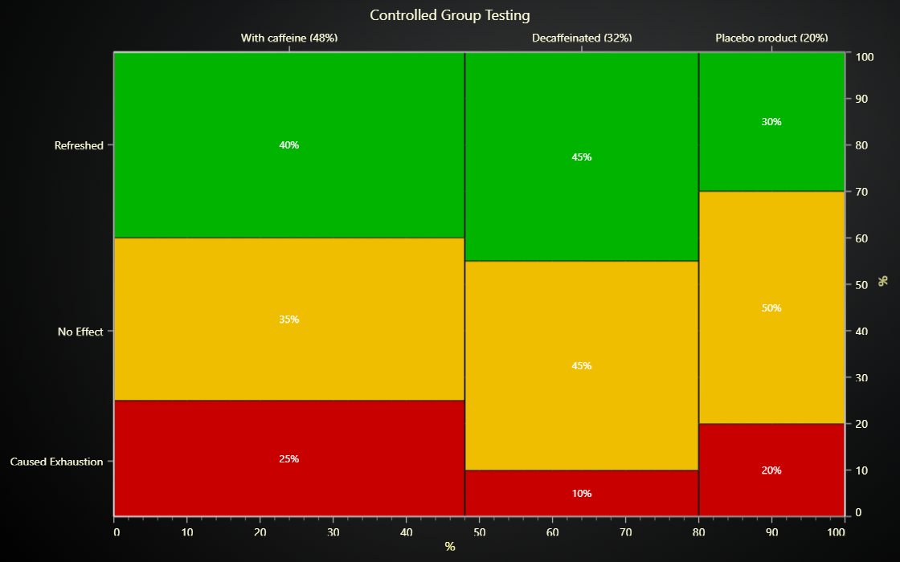

# JavaScript Mosaic Chart



This demo application belongs to the set of examples for LightningChart JS, data visualization library for JavaScript.

LightningChart JS is entirely GPU accelerated and performance optimized charting library for presenting massive amounts of data. It offers an easy way of creating sophisticated and interactive charts and adding them to your website or web application.

The demo can be used as an example or a seed project. Local execution requires the following steps:

-   Make sure that relevant version of [Node.js](https://nodejs.org/en/download/) is installed
-   Open the project folder in a terminal:

          npm install              # fetches dependencies
          npm start                # builds an application and starts the development server

-   The application is available at _http://localhost:8080_ in your browser, webpack-dev-server provides hot reload functionality.


## Description

_Also known as Marimekko Chart_

This example shows creation of a Mosaic Chart made on user side by utilizing RectangleSeries. Mosaic Chart can be used to compare observation counts of groups (sub-categories) across different categories.

Here's the creation of a Mosaic Chart using a pre-defined interface.

```javascript
// Create Chart.
const chart = mosaicChart()
// Add sub-categories (Each X-category can have a single value for each sub-category).
const A = chart.addSubCategory('A')
const B = chart.addSubCategory('B')
// Add categories (These are drawn progressively on X axis).
const category1 = chart.addCategory('Category #1')
const category2 = chart.addCategory('Category #2')
// Set values of categories (relative X size).
category1.setCategoryValue(60)
category2.setCategoryValue(40)
// Set values of sub-categories on categories (relative Y size).
category1.setSubCategoryValue(A, 40).setSubCategoryValue(B, 60)
category2.setSubCategoryValue(A, 80).setSubCategoryValue(B, 20)
```

The actual Mosaic Chart logic just serves to provide a starting point for users to create their own API based on their needs and preferences.


## API Links

* [XY cartesian chart]
* [Rectangle series]
* [Axis]
* [Solid FillStyle]
* [Empty FillStyle]
* [Solid LineStyle]
* [Empty LineStyle]
* [Empty TickStyle]
* [RGBA color factory]
* [UI position origins]


## Support

If you notice an error in the example code, please open an issue on [GitHub][0] repository of the entire example.

Official [API documentation][1] can be found on [LightningChart][2] website.

If the docs and other materials do not solve your problem as well as implementation help is needed, ask on [StackOverflow][3] (tagged lightningchart).

If you think you found a bug in the LightningChart JavaScript library, please contact sales@lightningchart.com.

Direct developer email support can be purchased through a [Support Plan][4] or by contacting sales@lightningchart.com.

[0]: https://github.com/Arction/
[1]: https://lightningchart.com/lightningchart-js-api-documentation/
[2]: https://lightningchart.com
[3]: https://stackoverflow.com/questions/tagged/lightningchart
[4]: https://lightningchart.com/support-services/

© LightningChart Ltd 2009-2022. All rights reserved.


[XY cartesian chart]: https://lightningchart.com/js-charts/api-documentation/v7.0.1/classes/ChartXY.html
[Rectangle series]: https://lightningchart.com/js-charts/api-documentation/v7.0.1/classes/RectangleSeries.html
[Axis]: https://lightningchart.com/js-charts/api-documentation/v7.0.1/classes/Axis.html
[Solid FillStyle]: https://lightningchart.com/js-charts/api-documentation/v7.0.1/classes/SolidFill.html
[Empty FillStyle]: https://lightningchart.com/js-charts/api-documentation/v7.0.1/variables/emptyFill-1.html
[Solid LineStyle]: https://lightningchart.com/js-charts/api-documentation/v7.0.1/classes/SolidLine.html
[Empty LineStyle]: https://lightningchart.com/js-charts/api-documentation/v7.0.1/variables/emptyLine.html
[Empty TickStyle]: https://lightningchart.com/js-charts/api-documentation/v7.0.1/variables/emptyTick.html
[RGBA color factory]: https://lightningchart.com/js-charts/api-documentation/v7.0.1/functions/ColorRGBA.html
[UI position origins]: https://lightningchart.com/js-charts/api-documentation/v7.0.1/variables/UIOrigins.html

